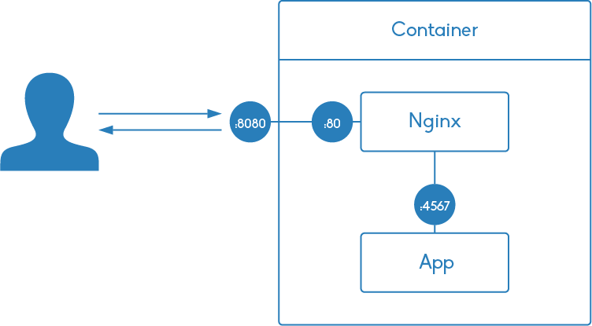

# Nginx Caching Example

Exercise used in my [blog post](http://czerasz.com/2015/03/30/nginx-caching-tutorial/).

## Overview

The diagram below illustrates the docker environment used in this exercise:

## Requirements

- [Docker](https://www.docker.com/)
- [curl](http://curl.haxx.se/)
